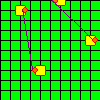
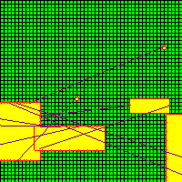

# RL-EDA - изучение обучения с подкреплением
## Главная мысль
Автоматизировать процесс размещения и трассировки печатной платы. Предполагается решать эти задачи, используя обучение с подкрпелением, то есть методы приближенного динамического программирования.
## Решение
Плату описали как граф (тополгия) и декартову систему координат. Сформировали МППР, где состояния целочисленные точки платы, действия - движения вверх, вниз, вправо, влево. Функция динамики - таблица, а вознаграждения считаем как сумму HPWL и плотности компоновки.
## Режимы работы
### Описано 4 режима работы: 
- **общая матрица состояний**
- **частные матрицы сотояний**
- **общие вознаграждения**
- **частные вознаграждения**
## Примеры работы
 **Конфигурация: Config3, размеры платы 10x10:**

 
**Конфигурация: Config2 размеры платы 50x50:**

---
 