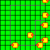
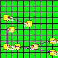
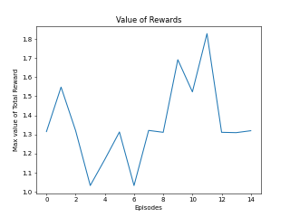
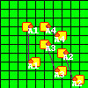

# RL-EDA - изучение обучения с подкреплением
## Главная мысль
Автоматизировать процесс размещения и трассировки печатной платы. Предполагается решать эти задачи, используя обучение с подкрпелением, то есть методы приближенного динамического программирования.
## Решение
Плату описали как граф (топология) и декартову систему координат. Сформировали МППР, где состояния целочисленные точки платы, действия - движения вверх, вниз, вправо, влево. Функция динамики - таблица, а вознаграждения считаем как сумму HPWL и плотности компоновки.
## Режимы работы
### Описано 4 режима работы: 
- **общая матрица состояний**
- **частные матрицы состояний**
- **общие вознаграждения**
- **частные вознаграждения**
## Примеры работы
 **Конфигурация - Config4, размеры платы 8x8:**

 
**Конфигурация - Config3, размеры платы 10x10:**

## Полученные результаты
Для конфигурации Config3 был построен график - "Value of Rewards". На нем изображены максимальные значения вознаграждений разных эпизодов работы алгоритма. Ниже представлены результаты улучшения компоновки и размещения, с помощью применения разработанной программы.

**Было:**

**Стало:**

**График "Value of Rewards":**

Новый вариант размещения и трассировки печатной платы, был спроектирован в соответствие с нормами проектирования и введенной оценочной функцией: ***alpha / HPWL + beta x Density***. Данный метод проектирования является пробным.

Пример с более сложной конфигурацией (Config2):

**Было:**

 

**Стало:**

Стоит отметить, что пересечение элемента проводами в данном варианте программы доступно, так как это не влияет на правильность и возможность проведения проводов по размеченной сетке.
## Установка
Скачиваем с репозитория:`git clone https://github.com/ilyaRozhin/RL_EDA`

Заходим в папку с программой: `cd RL_EDA`

Создаем новое окружение: `python3 -m venv venv`

Устанавливаем все зависимости: `venv/bin/python -m pip install -r requirements.txt`

Активируем новое окружение: `source venv/bin/acivate`

## Запуск

Команда: `python3 launchRL.py name_config h_board w_board grid_size alpha beta gamma_sarsa alpha_sarsa work_mode full_on count_of_iter count_of_episodes epsilon`

где  `name_config` - имя конфигурации (сейчас доступны `config2`,`config3` и `config4`); (`h_board`, `w_board`, `grid_size`) - длина платы, ширина и размер шага сетки; ( `alpha`,`beta`,`gamma_sarsa`,`alpha_sarsa`) - коэффициенты для расчета вознаграждений и работы  *Expected Sarsa*;`work_mode` - режим работы программы с общей матрицей состояний; `full_on` - обновление частных оценок общим вознаграждением; `count_of_iter` - количество итераций в одном эпизоде; `count_of_episodes` - количество эпизодов; `epsilon` - мера изучения.

Пример запуска: `python3 launchRL.py config3 100 100 10 1 1 0.3 1 True True 1000 20 0.1`

## Обновление
Добавлен алгоритм симуляции отжига - AnnealingSim.py.
Можно запустить с помощью команды: `python3 AnnealingSim.py alpha beta count_iter start_temperature config_name h_board w_board grid_size`

### Результаты работы алгоритма симуляции отжига

**Было:**

**Стало:**

**График:**

### Результаты сравнения целочисленного AS алгоритма и динамического RL

Средняя разница выполнения одного прогона алгоритма с 10000 итерациями для конфигурации Config3.

Отношение максимального вознаграждения получаемого RL к максимальной энерегии в AS.

---
